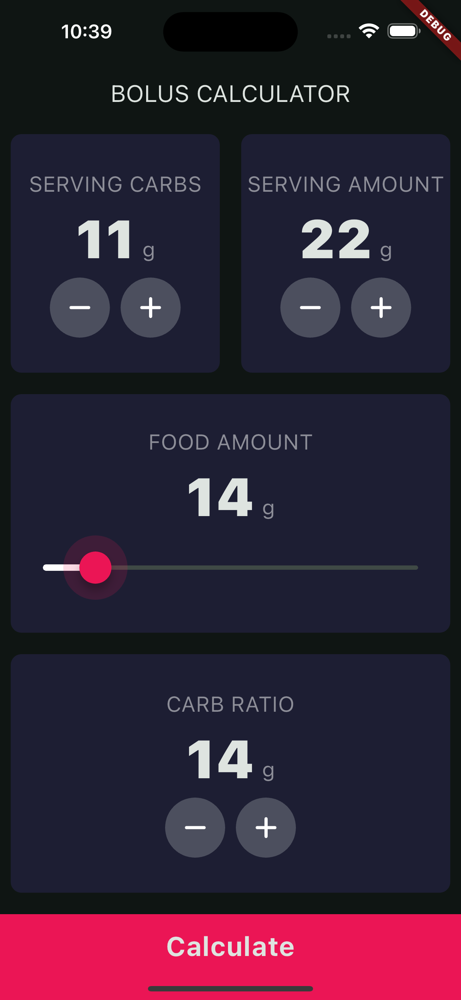

# Bolus Calculator

**Please note that this is only a demo! Please do not use this calculator for diabetes management. Always consult your doctor about insulin dosing**

This app is a very simple insulin dosing calculator. The user can input nutritional information about the carbohydrate content and serving size, the amount being consumed, and the relevant carbohydrate to insulin ratio. When the user clicks on the "Calculate" button, the input values are used to compute the appropriate insulin dose, along with a positive message. 

  
  

## Caveats

This app was created as a learning project for me. It is absolutely not intended for use by diabetics in calculating insulin doses. In fact, it only computes a part of what's required to properly dose insulin. The final amount will also depend on other factors like blood glucose at the time of the meal and also on insulin sensitivity. 

